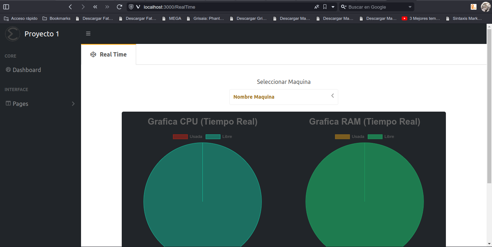

# Manual Técnico (Proyecto 1 Sistemas Operativos 1 "N")

## Introducción

<p style="text-align: justify;">
Dentro del primer proyecto del laboratorio de Sistemas Operativos 1, fue realizada tanto por medio de la utilización de maquinas virtuales GCP Compute Engine de Google Cloud, las aplicaciiones realizadas para dichas máquinas fueron módulos para el escaneo del Kernel del sistema operativo de las mísmas y un backend para el envio y recibimiento de información, en de las cuales los módulos fueron creados por medio del lenguaje de programación C++ y tambien para su compilado la utilización de Markdown para ejecutar dichos módulos, utilizando diferentes métodos para la obtención de la información pedida para dicho proyecto, Mediante el cúal se hizo un Backend en el lenguaje de programación Go (Golang) para la obtención de la información de los módulos; En el ordenador se creó para la plataforma de monitoreo un backend en NodeJS por medio de peticiones de React para conectar y hacer peticiones al backend de Go y este mismo enviaba y hacia peticiones a la base de datos de MySQL para posteriormente recibir la información de React.<br/><br/>

Se empleo el lenguaje de C++ como herramienta en la función de las de monitoreo y obtención de información del Sistema Operativo de la maquina virtual, que por medio del Backend de Go se creaba un archivo tanto para el CPU como para la memoria RAM en las cuales se sobreescribia la información con respecto al tiempo; de las cuales por medio de NodeJS se hacían peticiones al backend de GO para la obtención de la información, enviarla a la base de datos de MySQL y posteriormente por medio de una petición 'GET' de React enviarle la información a tiempo real para la monitorización de la máquina virtual (2 máquinas fueron creadas para el proyecto de GCP, teniendo para Autoscaling otras 2 que se crearían al utilizar cierto porcentaje del CPU de las máquinas virtuales), el proyecto cuenta con peticiones GET y DELETE; en donde la plataforma de React puede hacer peticiones para tambien eliminar procesos de la MV y obtener los procesos actuales y por medio de otra pagina para poder ver los registros a lo largo del tiempo tanto de la memoria RAM como del CPU.<br/><br/>

Se pudo determinar que la implementación de los módulos y el almacenamiento de la información obtenida en cada una de ellos no mostro ningún problema durante su ejecución.
</p>

## Requisitos del Sistema

>- **_Sistema Operativo:_** Ubuntu 20.04 o superior
>- **_Kernel Utilizado:_** linux-headers-6.2.0-32-generic
>- **_CPU:_** Intel Pentium D o AMD Athlon 64 (K8) 2.6GHz. (Requisitos Mínimo)
>- **_RAM:_** 600MB
>- **_Lenguajes Utilizados:_** C++, Go, Markdown, JavaScript
>- **_Base de Datos:_** MySQL
>- **_Contenedores:_** Docker
>- **_IDE:_** Visual Studio Code
>- **_USO de Framework (Backend):_** NodeJS
>- **_USO de Framework (Frontend):_** React

## Requisitos del Proyecto:

### NodeJS

>- **_"axios":_** "^1.5.0"
>- **_"cors":_** "^2.8.5"
>- **_"dotenv":_** "^16.3.1"
>- **_"express":_** "^4.18.2"
>- **_"mysql":_** "^2.18.1"
>- **_"mysql2":_** "^3.6.1"

### React (dependencies):

>- **_"@testing-library/jest-dom":_** "^5.16.5"
>- **_"@testing-library/react":_** "^13.4.0"
>- **_"@testing-library/user-event":_** "^13.5.0"
>- **_"axios":_** "^1.4.0"
>- **_"body-parser":_** "^1.20.2"
>- **_"chart.js":_** "^4.4.0"
>- **_"fusioncharts":_** "^3.20.0"
>- **_"react":_** "^18.2.0"
>- **_"react-chartjs-2":_** "^5.2.0"
>- **_"react-dom":_** "^18.2.0"
>- **_"react-draggable"_**: "^4.4.5"
>- **_"react-fusioncharts":_** "^4.0.0"
>- **_"react-graphviz":_** "^0.7.0"
>- **_"react-scripts":_** "5.0.1"
>- **_"web-vitals":_** "^2.1.4"

### React (devDependencies):

>- **_"@types/d3":_** "^7.4.0"
>- **_"@types/d3-graphviz":_** "^2.6.7"
>- **_"@types/file-saver":_** "^2.0.5"
>- **_"@types/lodash":_** "^4.14.182"
>- **_"@types/node":_** "^16.18.23"
>- **_"@types/react":_** "^18.0.35"
>- **_"@types/react-anchor-link-smooth-scroll":_** "^1.0.2"
>- **_"electron":_** "^24.8.3"
>- **_"fs-extra":_** "^11.1.1"
>- **_"path-browserify":_** "^1.0.1"
>- **_"tslint":_** "^5.12.1"
>- **_"webpack-cli":_** "^5.0.2"

## Explicación del Código

### Módulos C++

#### Módulo CPU

Mediante la método de obtener calculate_cpu_usage se obtendrá la información del uso del CPU en ese mismo instante.

```
static unsigned long calculate_cpu_usage(void) {
    char buf[256];
    struct file *file;
    unsigned long total_time, idle_time;

    file = filp_open("/proc/stat", O_RDONLY, 0);
    if (!file)
        return 0;

    kernel_read(file, buf, sizeof(buf), &file->f_pos);
    filp_close(file, NULL);

    sscanf(buf, "cpu %lu %lu %lu %lu %lu %lu %lu %lu", &user, &nice,
           &system, &idle, &iowait, &irq, &softirq, &steal);
    
    total_time = user + nice + system + idle + iowait + irq + softirq + steal;
    idle_time = idle + iowait;

    return 100 * (total_time - idle_time) / total_time;
}
```

Y mediante la método show_cpu_stat se obtendrán los procesos que tiene el ordenador, el PID, UID, nombre del equipo, el usuario que ejecuta cada proceso, el estado, memoria fisica y virtual de cada proceso, escribiendo un archivo (en este caso la estructura en un JSON).

```
static int show_cpu_stat(struct seq_file *f, void *v) {
    struct new_utsname *utsname;
    utsname = init_utsname();

    seq_printf(f, "{\n");
    seq_printf(f, "\t\"Nombre_equipo\": \"%s\",\n", utsname->nodename);
    usage = calculate_cpu_usage();  // Calcular el uso de CPU
    seq_printf(f, "\t\"Uso_de_CPU\": %lu,\n", usage);
    //seq_printf(f, "\t\"Usuario_actual\": %u,\n", current_uid().val);
    seq_printf(f, "\t\"Procesos\": [\n");
    
    for_each_process(task) {
        cred = get_task_cred(task);
        state = task_state_to_char(task);
        vsize = task->mm ? task->mm->total_vm << (PAGE_SHIFT - 10) : 0;
        rss = task->mm ? get_mm_rss(task->mm) << (PAGE_SHIFT - 10) : 0;

        seq_printf(f, "\t\t{ \"Proceso\": \"%s\", \"PID\": %d, \"UID\": %u, \"Estado\": \"%c\", \"Memoria_virtual\": %lu, \"Memoria_fisica\": %lu },\n",
               task->comm, task->pid, cred->uid.val, state, vsize, rss);
        put_cred(cred);
    }

    seq_printf(f, "\t\t{ \"Proceso\": \"NAC\", \"PID\": -1, \"UID\": -1, \"Estado\": \"NAC\", \"Memoria_virtual\": 0, \"Memoria_fisica\": 0 }\n");
    seq_printf(f, "\t]\n");

    
    seq_printf(f, "}\n");
    return 0;
}
```

Tambien se cuenta con los métodos siguientes los cuales sirven para escribir en la carpeta /proc el archivo del CPU por medio de cpu_module_init & cpu_module_exit.

```
#define FileProc "cpu_201906051"

static int cpuinfo_proc_open(struct inode *inode, struct file *file) {
    return single_open(file, show_cpu_stat, NULL);
}

static const struct proc_ops Cpuinfo_fops = {
    .proc_open = cpuinfo_proc_open,
    .proc_read = seq_read,
    .proc_lseek = seq_lseek,
    .proc_release = single_release
};

static int __init cpu_module_init(void) {
    printk(KERN_INFO "Módulo del kernel cargado.\n");
    proc_create(FileProc, 0777, NULL, &Cpuinfo_fops);
    printk(KERN_INFO "Archivo creado: /proc/%s\n", FileProc);
    return 0;
}

static void __exit cpu_module_exit(void) {
    printk(KERN_INFO "Módulo del kernel descargado.\n");
    remove_proc_entry(FileProc, NULL);
}
```
#### Módulo RAM

Mediante el método show_memory_stat se obtendrá el uso de la ram, el total usado, la ram usada y la ram en uso, al igual que el porcentaje escribiendo un archivo en /proc (en este caso la estructura en un JSON).

```
static int show_memory_stat(struct seq_file *f, void *v){
    si_meminfo(&i);
    struct new_utsname *utsname;
    utsname = init_utsname();
	
    // seq_printf(f,"%lu\n",((i.freeram*100)/i.totalram));
    seq_printf(f,"{\n");
    seq_printf(f, "\t\"Nombre_equipo\": \"%s\",\n", utsname->nodename);
    seq_printf(f, "\t\"Uso_ram\":[\n");
    seq_printf(f, "\t\t{\n");
    seq_printf(f,"\t\t\t\"total_ram\":" "%lu,\n", ((i.totalram) << (PAGE_SHIFT -10))/1024 );
    seq_printf(f,"\t\t\t\"Ram_en_uso\":" "%lu,\n",(  ( ( ( (i.totalram) << (PAGE_SHIFT -10) )  -  ( (i.freeram) << (PAGE_SHIFT -10) ) )) /1024 ) );
    seq_printf(f,"\t\t\t\"Ram_libre\":""%lu,\n",( (i.freeram) << (PAGE_SHIFT -10) ) /1024);
    seq_printf(f,"\t\t\t\"Porcentaje_en_uso\":" "%lu\n",(  (( ( ( (i.totalram) << (PAGE_SHIFT -10) )  -  ( (i.freeram) << (PAGE_SHIFT -10) ) )) /1024 )/100 ));
    seq_printf(f, "\t\t}\n");
    seq_printf(f,"\t]\n}\n");
    return 0;
}
```

Tambien se cuenta con los métodos siguientes los cuales sirven para escribir en la carpeta /proc el archivo de la memoria RAM por medio de start_function & clean_function.

```
static int meminfo_proc_open(struct inode *inode, struct file*file){
    return single_open(file,show_memory_stat, NULL);
}

static const struct proc_ops Meminfo_fops = {
    .proc_open = meminfo_proc_open,
    .proc_read = seq_read,
    .proc_lseek  = seq_lseek,
	.proc_release = seq_release
};


static int __init start_function(void){
    printk(KERN_INFO "Modulo RAM cargado");
    proc_create (FileProc, 0777, NULL, &Meminfo_fops);
	printk(KERN_INFO "Archivo Creado: /proc/%s\n",FileProc);
	return 0;
}

static void __exit clean_function(void){
    printk(KERN_INFO "Modulo RAM eliminado");
    remove_proc_entry(FileProc, NULL);
}
```

### Backend Go

Se tendrán las estructuras para obtener la información de los procesos y del CPU al igual que la memoria RAM.

```
type Procesos struct {
	Proceso  string `json:"Proceso"`
	PID      int    `json:"PID"`
	UID      int    `json:"UID"`
	Estado   string `json:"Estado"`
	MemoriaV int    `json:"Memoria_virtual"`
	MemoriaF int    `json:"Memoria_fisica"`
}

type InfoCPU struct {
	NombreEquipo string     `json:"Nombre_equipo"`
	Proc         []Procesos `json:"Procesos"`
	UsoCPU       int        `json:"Uso_de_CPU"`
	//UsuarioActual string     `json:"Usuario_actual"`
}

type Ram struct {
	Total_ram         int `json:"total_ram"`
	Ram_en_uso        int `json:"Ram_en_uso"`
	Ram_libre         int `json:"Ram_libre"`
	Porcentaje_en_uso int `json:"Porcentaje_en_uso"`
}

type InfoRam struct {
	Nombre_equipo string `json:"Nombre_equipo"`
	Uso_ram       []Ram  `json:"Uso_ram"`
}
```

Tenemos las rutas para obtener la información del CPU y de la Memoria RAM de los airchivos Json creados y sobreescribidos de los módulos.

```
http.HandleFunc("/ram-info", func(w http.ResponseWriter, r *http.Request) {
		ramInfo, err := readRamInfo()
		if err != nil {
			http.Error(w, "Error leyendo información del Módulo RAM", http.StatusInternalServerError)
			return
		}
		w.Header().Set("Content-Type", "application/json")
		json.NewEncoder(w).Encode(ramInfo)
	})
	http.HandleFunc("/cpu-info", func(w http.ResponseWriter, r *http.Request) {
		cpuinfo, err := readCPUInfo()
		if err != nil {
			fmt.Println(err)
			http.Error(w, "Error leyendo información del Módulo CPU", http.StatusInternalServerError)
			return
		}
		w.Header().Set("Content-Type", "application/json")
		json.NewEncoder(w).Encode(cpuinfo)
	})
	fmt.Println("Backend server is running on :8080")
	http.ListenAndServe(":8080", nil)
```

Con el metodo /kill recibe un Json `{ pid: "<numero_pid>" }` eliminando el proceso.

```
http.HandleFunc("/kill", func(w http.ResponseWriter, r *http.Request) {
		if r.Method != http.MethodPost {
			http.Error(w, "Método no permitido", http.StatusMethodNotAllowed)
			return
		}

		// Leer el cuerpo de la solicitud POST
		var requestBody struct {
			PID string `json:"pid"`
		}

		err := json.NewDecoder(r.Body).Decode(&requestBody)
		if err != nil {
			http.Error(w, "Error al leer el cuerpo de la solicitud", http.StatusBadRequest)
			return
		}

		// Extraer el PID del cuerpo de la solicitud
		pid := requestBody.PID
		fmt.Println("Borrar proceso", pid)
		cmd := exec.Command("kill", "-9", pid)
		err = cmd.Run()
		if err != nil {
			fmt.Println("Error en la ejecución")
			http.Error(w, err.Error(), http.StatusInternalServerError)
			return
		}
		fmt.Fprintln(w, "Proceso '"+pid+"' eliminado exitosamente")
	})
```

### Base de Datos

Se tiene la sigiente base de datos creada:

```
CREATE TABLE InfoCOMPU (
    IT INT AUTO_INCREMENT PRIMARY KEY,
    Nombre_equipo VARCHAR(255) NOT NULL,
    UsoCPU INT NOT NULL,
    Total_RAM INT NOT NULL,
    RAM_Uso INT NOT NULL,
    RAM_Libre INT NOT NULL,
    Porcentaje_RAM INT NOT NULL,
    fecha_registro DATETIME NOT NULL
);
```

La cual obtiene la información requerida para almacenar en MySQL, para luego hacer peticiones para obtener su información.


### Backend NodeJS

#### Conexión a la Base de Datos de MySQL

Verifica que la base de datos exista y exista la tabla para la inserción de datos

```
const dbConfig = {
    host: process.env.DB_HOST,
    user: process.env.DB_USER,
    port: process.env.DB_PORT,
    password: process.env.DB_PASSWORD,
    database: process.env.DB_NAME
};

async function connectToDatabase() {
    try {
        const connection = await mysql.createConnection(dbConfig);
        // Consulta para obtener la lista de tablas en la base de datos
        //const [rows] = await connection.query('SHOW TABLES');
        
        // Mostrar las tablas disponibles
        //console.log('Tablas en la base de datos:');
        //for (const row of rows) {
        //    console.log('Tabla: [', row[`Tables_in_${dbConfig.database}`], ']');
        //}
        
        console.log('Conexión a la base de datos exitosa');
        return connection;
    } catch (error) {
        console.error('Error al conectar a la base de datos: ', error);
        throw error;
    }
}
```

#### Registro de información

Se va a registrar toda la información obtenida por el método `/live?eQuipo=<Equipo>`, para enviar la información de la máquina y registrar a la base de datos de MySQL la información del ordenador en ese momento.

```
app.get('/live', async (req, res) => {
    const eQuipo = req.query.eQuipo;

    if (!eQuipo) {
        return res.status(400).json({error: 'Error de maquina'})
    }

    let connection;
    try {
        connection = await connectToDatabase();
        
        if (eQuipo.toString() === maquinas_virtuales[0].id){
            //maquina1
            const externalServiceResponseRAM1 = await axios.get('http://34.42.36.164:8080/ram-info');
            const externalServiceResponseCPU1 = await axios.get('http://34.42.36.164:8080/cpu-info');

            const ramData1 = externalServiceResponseRAM1.data;
            const cpuData1 = externalServiceResponseCPU1.data;
            
            await insertarNuevaMaquina(connection, ramData1, cpuData1);
            
            console.log('Datos ingresados correctamente en', eQuipo.toString());
            const responseData = {
                CPU: cpuData1,
                RAM: ramData1,
            };    
            res.json(responseData);
        }else if (eQuipo.toString() === maquinas_virtuales[1].id){
            //maquina2
            const externalServiceResponseRAM2 = await axios.get('http://34.135.153.28:8080/ram-info');
            const externalServiceResponseCPU2 = await axios.get('http://34.135.153.28:8080/cpu-info');
            
            const ramData2 = externalServiceResponseRAM2.data;
            const cpuData2 = externalServiceResponseCPU2.data;
            await insertarNuevaMaquina(connection, ramData2, cpuData2);
            
            console.log('Datos ingresados correctamente en', eQuipo.toString());
            const  responseData = {
                CPU: cpuData2,
                RAM: ramData2
            };
            res.json(responseData);
        }else{
            res.json({ error: 'Maquina no existente' })
        }
    } catch (error) {
        console.error('Error al obtener la información:', error);
        res.status(500).json({ error: 'Error interno del servidor' });
    } finally {
        if (connection) {
            connection.end();
        }
    }
});

async function insertarNuevaMaquina(connection, ram_data, cpu_data) {
    try {
        const fechaHoraActual = new Date();
        const hora_ac = fechaHoraActual.toISOString().slice(0, 19).replace('T', ' ');

        await connection.query('INSERT INTO InfoCOMPU (Nombre_equipo, UsoCPU, Total_RAM, RAM_Uso, RAM_Libre, Porcentaje_RAM, fecha_registro) VALUES (?, ?, ?, ?, ?, ?, ?)', [
            cpu_data.Nombre_equipo, //neqipo
            cpu_data.Uso_de_CPU, //usocpu totalram ramuso ramlibre %ram fecha
            ram_data.Uso_ram[0].total_ram,
            ram_data.Uso_ram[0].Ram_en_uso,
            ram_data.Uso_ram[0].Ram_libre,
            ram_data.Uso_ram[0].Porcentaje_en_uso,
            hora_ac
        ]);
        //console.log('Datos subidos con exito')
    } catch (e) {
        console.log('Error en la inserción de datos', e);
    }
}
```

#### Eliminar Proceso

Envia una petición Delete a NodeJS con la información del equipo con el cual se eliminará la información

```
app.delete('/kill-proccess', async (req, res) => {
    const equipo = req.query.equipo;

    if (!equipo) {
        return res.status(400).json({error: 'Error maquina no existente'})
    }

    try {
        const pid = req.body.pid; // Obtiene el PID del cuerpo de la solicitud POST
        let backendGoUrl = '';
        maquinas_virtuales.forEach((value) => {
            if (equipo.toString() === value.id.toString()){
                backendGoUrl = 'http://'+value.url+':8080/kill';
            }
        });

        if (!backendGoUrl) {
            return res.status(400).json({ error: 'Ruta no existente' });
        }

        console.log(backendGoUrl);

        const data = {
            pid: pid,
        };

        axios
            .post(backendGoUrl, data)
            .then((response) => {
                console.log(response.data);
                res.json(response.data); // Devuelve la respuesta del servidor Go
            })
            .catch((error) => {
                console.error('Error al realizar la solicitud POST:', error);
                res.status(500).json({ error: 'Error interno del servidor' });
            });
    } catch (error) {
        console.error('Error en eliminar el proceso:', error);
        res.status(500).json({ error: 'Error interno del servidor' });
    }
});
```

#### Obtener Registro por Equipo

Se obtienene los registros del ordenador a lo largo del tiempo por medio del siguiente método

```
app.get('/registros-por-equipo', async (req, res) => {
    const nombreEquipo = req.query.nombreEquipo;

    if (!nombreEquipo) {
        return res.status(400).json({ error: 'Debe proporcionar el nombre del equipo como parámetro de consulta (nombreEquipo).' });
    }
    
    let connection;
    try {
        connection = await connectToDatabase();

        const [rows] = await connection.query('SELECT * FROM InfoCOMPU WHERE Nombre_equipo = ?', [nombreEquipo]);

        if (rows.length === 0) {
            return res.json({ mensaje: 'No se encontraron registros para el equipo especificado.' });
        }

        res.json({ registros: rows });
    } catch (error) {
        console.error('Error al obtener los registros por equipo:', error);
        res.status(500).json({ error: 'Error interno del servidor' });
    } finally {
        if (connection) {
            connection.end();
        }
    }
});
```

### Frontend (React):

Tenemos la página inicial en donde va a enrutar primero la api


También está la página de los datos del desarrollador


Tenemos la platafomra inicial en donde uno puede ver las graficas a lo en tiempo real y una lista desplegable para elegir la maquina a monitorear.




Está la página de Graficas a lo largo del tiempo, en donde se mostrarán todos los registros que tuvo el ordenador.


### VM (Virtual Machines)

Tenemos las VM las cuales van a estar obteniendo la información de su CPU y RAM, estas por medio del Backend de Go enviaran por peticiones la información de las mismas.


Tambien tiene el medio de Stress para crear nuevas Maquinas virtuales luego de superar el 60% que utiliza del procesador.


### Google Cloud (GCP)

El cambio que se da en máquinas virtuales para crear más (máximo de máquinas es 4, el mínimo 2)


### Comandos utilizados en VM:

#### Instalación Docker

>- sudo apt-get update
>- sudo apt-get install -y apt-transport-https ca-certificates curl software-properties-common
>- curl -fsSL https://download.docker.com/linux/ubuntu/gpg | sudo gpg --dearmor -o /usr/share/keyrings/docker-archive-keyring.gpg
>- echo "deb [arch=amd64 signed-by=/usr/share/keyrings/docker-archive-keyring.gpg] https://download.docker.com/linux/ubuntu $(lsb_release -cs) stable" | sudo tee /etc/apt/sources.list.d/docker.list > /dev/null
>- sudo apt-get update
>- sudo apt-get install -y docker-ce docker-ce-cli containerd.io
>- sudo usermod -aG docker $USER
>- sudo docker --version


#### Obtener Repositorio de imagen para backend de Go

>- sudo docker pull iskandar1412/proyecto1_201906051:v2

#### Instalación & configuración de paquetes para Makefile y C++

>- sudo apt-get install gcc && sudo apt-get install make && sudo apt-get install git
>- sudo apt install build-essential
>- sudo apt-get install manpages-dev
>- sudo apt update
>- sudo apt install gcc-12
>- sudo update-alternatives --install /usr/bin/gcc gcc /usr/bin/gcc-12 100

#### Correr archivos de C++

>- make
>- sudo insmod <nombre_modulo>.ko

#### Desmontar módulos

>- sudo insmod <nombre_modulo>

#### Ver módulo

>- cat /proc/<modulo>

#### Correr imagen docker (Go)

>- sudo docker images
>- sudo docker run -it --rm -p 8080:8080 <nombre_imagen>

### Comandos utilizados para ordenador (levanar imagenes de backend de NodeJs, Frontend y db)

>- sudo docker compose up