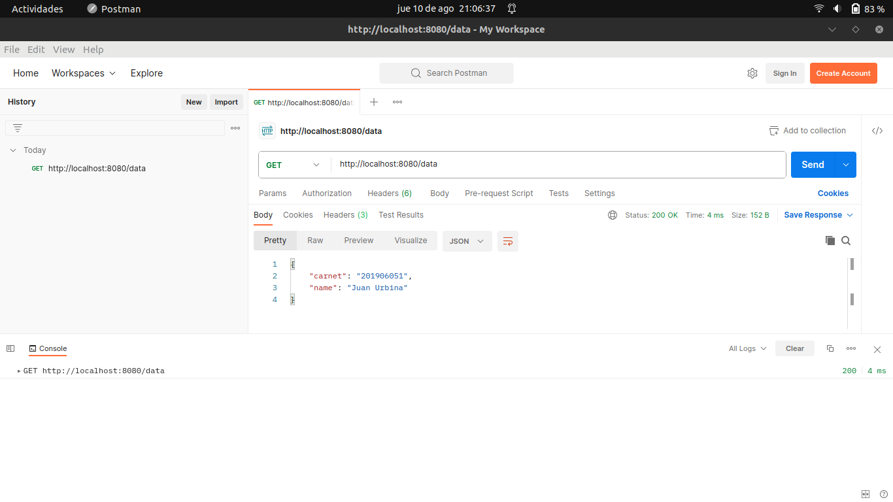
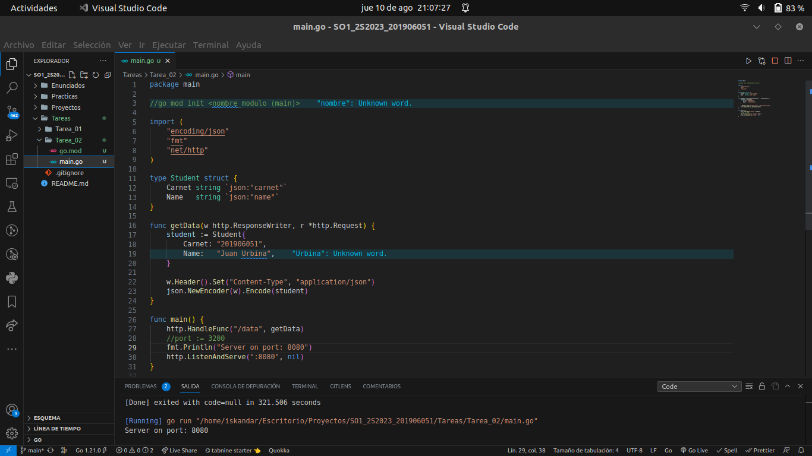
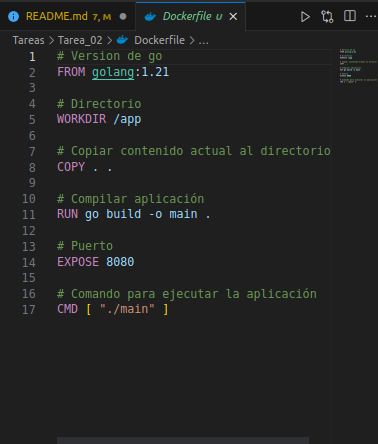
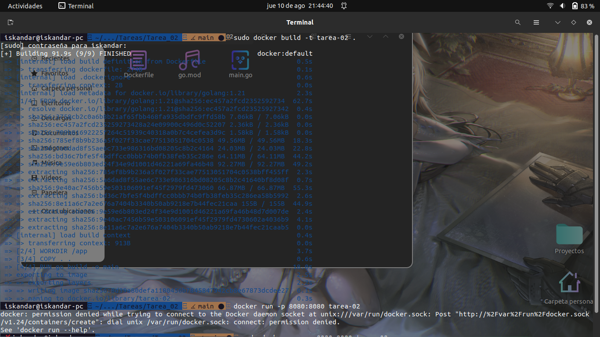
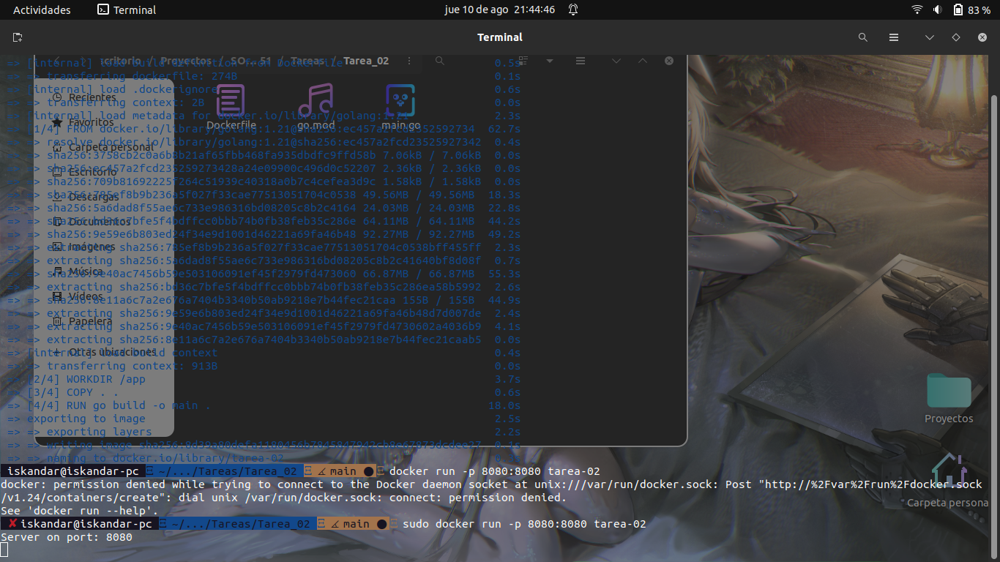
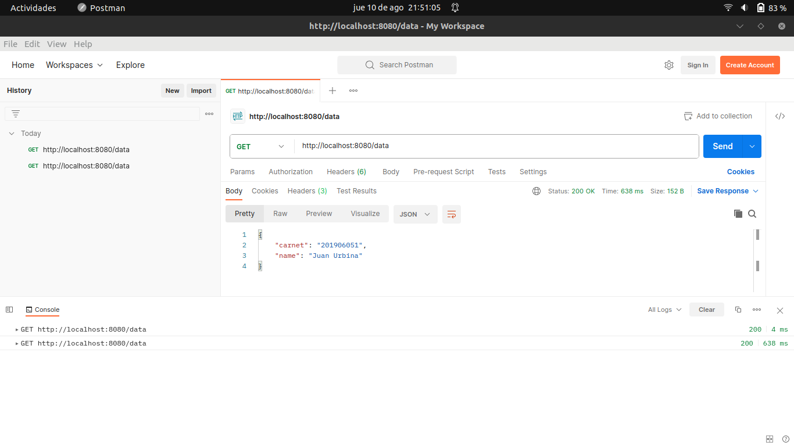
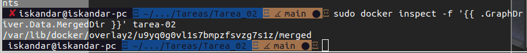
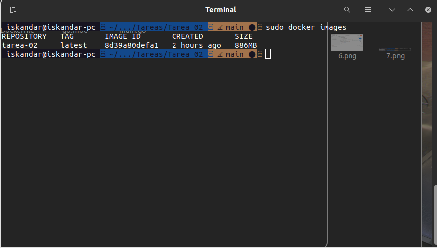

## Tarea 2

>Se crea primero el archivo de go y tambien el archivo mod (evitar problemas de modulos) `go mod init main`  
>Creamos structs para el estudiante  
>Creamos una función que va a obtener en formato json los datos del estudiante 
>En la función principal obtenemos la información del metodo, y corremos el servidor en el puerto `8080`

>Creamos el archivo Dockerfile

>Creamos nuestra imagen (en este caso se le llamo `tarea-02`)

>Corremos la imagen `tarea-02`

>Verificamos que este la imagen de `tarea-02`

